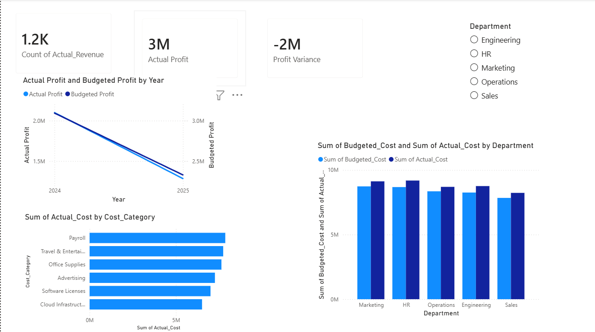
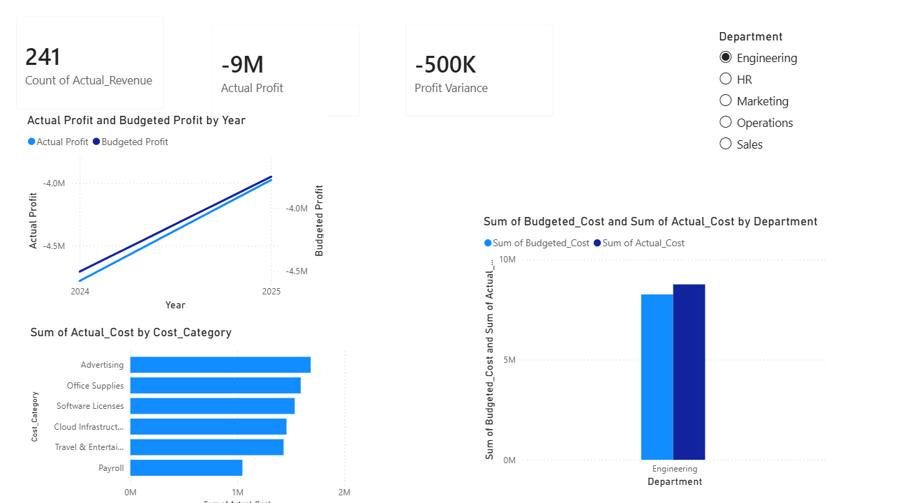

# 📉 Financial Performance & Variance Analysis Dashboard


An executive-level financial dashboard tracking profit trends, cost drivers, and budget-vs-actual performance — built to support faster, data-driven capital allocation decisions.

---

## 📑 Table of Contents

- [Project Overview](#-project-overview)
- [Business Questions Answered](#-business-questions-answered)
- [Data Pipeline & Methodology](#%EF%B8%8F-data-pipeline--methodology)
- [Visual Insights](#-visual-insights)
- [Key Findings](#-key-findings)
- [Project Structure](#-project-structure)
- [Author](#-author)

---

## 🚀 Project Overview

Maintaining financial discipline is critical to corporate health — but raw transactional logs rarely tell leadership where money is actually going. This project builds a comprehensive financial dashboard that tracks operational expenditure and revenue generation, giving stakeholders an executive-level view of profit trends, cost drivers, and budget adherence to support better capital allocation decisions.

---

## 🎯 Business Questions Answered

| # | Question | Why it matters |
|---|---|---|
| 1 | **Profit Trends** — What's the trajectory of net profit, and are targets being met? | Shows whether the business is on track or falling behind plan |
| 2 | **Cost Drivers** — Which operational categories (Payroll, Infrastructure, etc.) consume the most capital? | Identifies where cost control efforts will have the biggest impact |
| 3 | **Variance Analysis** — How does actual performance compare to budget across departments? | Flags departments overspending or underperforming against targets |

---

## ⚙️ Data Pipeline & Methodology

<details>
<summary><strong>1. Data Processing & Standardization (Excel)</strong></summary>
<br>

- Cleaned raw financial logs and standardized currency formats.
- Validated categorical consistency across departmental and cost-center columns.
</details>

<details>
<summary><strong>2. Financial Modeling (SQL)</strong></summary>
<br>

- Authored SQL scripts (`financial_performance_data_queries.sql`) to aggregate core financial metrics.
- Calculated baseline Net Profit, Total Revenue, and Variance figures to verify data integrity before visualization.
</details>

<details>
<summary><strong>3. Executive Reporting (Power BI)</strong></summary>
<br>

- Built custom DAX measures for dynamic `Actual Profit`, `Budgeted Profit`, and `Profit Variance` calculations.
- Designed an interactive reporting suite with time-series trend analysis and side-by-side departmental budget comparisons.
</details>

---

## 📊 Visual Insights

**Executive Profit & Target Overview**
*Top-line revenue, profit trends, and major cost drivers at a glance.*



**Departmental Budget Variance Analysis**
*Comparing actual vs. budgeted cost across departments to spot overspending.*



---

## 🔍 Key Findings

- **Actual profit reached $3M**, against a **profit variance of -$2M** — actual performance is trending below budgeted targets.
- **Payroll** is the single largest cost category, ahead of Travel & Entertainment and Cloud Infrastructure.
- Actual cost **exceeded budgeted cost in every department** (Marketing, HR, Operations, Engineering, Sales) — this is a company-wide overspend pattern, not isolated to one team.
- The gap between actual and budgeted profit **widens over the 2024–2025 period**, suggesting the variance is compounding rather than a one-time event.

---

## 📁 Project Structure

```
├── Data/
│   └── financial_performance_data.csv          # Cleaned dataset
├── SQL_Scripts/
│   └── financial_performance_data_queries.sql  # Financial aggregations
├── Dashboard/
│   └── financial_performance_analysis.pbix     # Power BI project file
├── Media/
│   ├── executive_profit_overview.png           # Dashboard screenshot
│   └── budget_variance_analysis.png            # Dashboard screenshot
└── README.md
```

---

## 👨‍💻 Author

**Nizam Ud Din**
B.S. Computer Science — University of Turbat

Data Analyst building hands-on experience with Excel, SQL, and Power BI through real end-to-end projects.

📧 balochnizam410@gmail.com · 🔗 [Portfolio](https://nizam001-ui.github.io/data-analyst-portfolio/)
